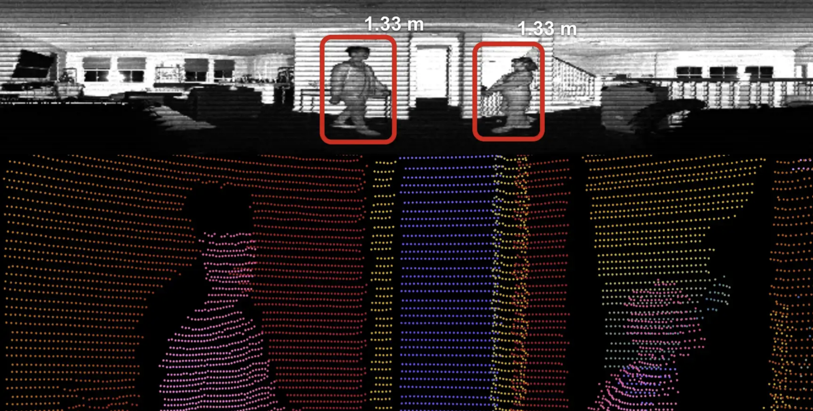

# ouster-yolov5-demo
This repo contains sample code on how to utilize Ouster Lidar Data to perform
common image processing tasks like object detection classification using YOLOv5.
The sample codes can be ran locally or using Google Colab Notebooks. For a quick
start we recommend using the Google Colab demo since it has additional notes.



- [ouster-yolov5-demo](#ouster-yolov5-demo)
  - [Running the demo on Google Colab](#running-the-demo-on-google-colab)
  - [Running the demo locally](#running-the-demo-locally)
    - [Requirements](#requirements)
    - [Getting Lidar Data](#getting-lidar-data)
    - [Ouster YOLOv5 Demo with OpenCV](#ouster-yolov5-demo-with-opencv)
    - [Ouster YOLOv5 Demo with SimplViz](#ouster-yolov5-demo-with-simplviz)

## Running the demo on Google Colab

Follow the link <a href="https://colab.research.google.com/github/Samahu/ouster-yolov5-demo/blob/main/Ouster_Yolo5_Demo.ipynb" target="_parent"></a> to run the demo using Google Colab

## Running the demo locally

### Requirements
```bash
pip install -r requirements.txt
```

### Getting Lidar Data
The repo [yolov5-ouster-lidar-data](https://github.com/ouster-lidar/yolov5-ouster-lidar-data) contains some sample lidar data that you could use with the provided python examples. The two files `Ouster-YOLOv5-sample.json` and `Ouster-YOLOv5-sample.pcap` are currently expected to sit next to python scripts. 

### Ouster YOLOv5 Demo with OpenCV
[Ouster YOLOv5 Demo](./yolo5_opencv.py)

### Ouster YOLOv5 Demo with SimplViz
[Ouster YOLOv5 Demo / SimpleViz](./yolo5_simpleviz.py)
